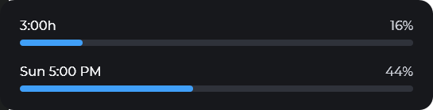

# Claude Usage Widget

A floating Windows widget that shows your Claude subscription usage right on the desktop:
two bars, the 5-hour window and the weekly window, with the same data you see when you
type `/usage` inside Claude Code.

No tabs to open, no commands to remember — the number that matters, always in sight.

## What it does

- **Real data**, not an estimate: it queries the same endpoint Claude Code uses,
  authenticated with the session you already have.
- **Two bars**, 5-hour usage and weekly usage, each with its percentage and its
  reset time.
- **Color by usage**, the same on both bars: blue below 50%, yellow below 70%, orange
  below 85% and red from there on.
- **Resizable window**: drag an edge or a corner and the text, the bars and the margins
  scale together. Drag from the middle to move it.
- Optional **always on top**, and it remembers its position and size between sessions.
- No frame, no title bar, no taskbar button: it's a widget, not just another window.

## Download and run

1. Go to [Releases](https://github.com/Ian8476/ClauWid/releases/latest) and download
   `ClaudeUsageWidget-win-x64.zip`.
2. Unzip it into any folder (the `.exe` needs the `Assets` folder next to it, for the
   font).
3. Run `ClaudeUsageWidget.exe`.

**Requirements:**

- Windows 10 or later.
- [.NET 8 Desktop Runtime](https://dotnet.microsoft.com/download/dotnet/8.0) installed
  (the `.exe` does not bundle it).
- [Claude Code](https://claude.com/claude-code) installed and signed in
  (`claude`, then `/login`). The widget reads the token from there; it never asks for
  credentials of its own.

## Usage

The menus are in Spanish; the labels below are shown as they appear in the app.

| Action | How |
|---|---|
| Move the window | Left-drag from anywhere on its surface |
| Resize it | Drag from any edge or corner |
| Reset the size | Right-click → "Restablecer tamaño" |
| Keep it always on top | Right-click → "Siempre visible" |
| Hide it | Right-click → "Ocultar" (bring it back from the tray icon → "Mostrar widget") |
| Quit | Right-click → "Salir", or tray icon → "Salir" |

Position and size are saved in `%LOCALAPPDATA%\ClaudeUsageWidget\placement.json`, one
entry per monitor combination: if you sometimes use a single 1920x1080 monitor and other
times a 2K display next to that same 1920x1080, the widget remembers where you left it in
each case and goes back there when it opens or when you plug and unplug screens. If the
remembered position would end up off-screen, it is centered on the primary monitor.

If you see `--` instead of a percentage, the widget couldn't read your usage: check that
Claude Code has an active session (`claude` in a terminal). The data doesn't vanish all
at once — while the source is down, the widget keeps the last known reading.

## Where the data comes from

The widget reads the OAuth token that Claude Code stores in
`%USERPROFILE%\.claude\.credentials.json` (or in `CLAUDE_CONFIG_DIR`, if you have it
set) and queries `https://api.anthropic.com/api/oauth/usage` every minute.

- **It never refreshes the token on its own:** doing so would rotate the refresh token
  and sign Claude Code out. When it finds the token expired, which is common if you only
  work with the desktop app, it runs `claude doctor` in the background, with no window
  and at most once every 15 minutes: that way it's Claude Code's own CLI that checks its
  session and renews it. That command doesn't consume quota. Meanwhile, the widget keeps
  the last known data.
- **Nothing leaves your machine** except that query to the Anthropic API with your own
  token. There's no telemetry and no intermediate server.
- **Undocumented endpoint**, the same one Claude Code uses internally, and it may change
  without notice. If it changes, the widget shows `--` instead of making up a number.

## Credits

Montserrat Medium is embedded in `src/ClaudeUsageWidget.Presentation.Wpf/Assets/Fonts`
under the [SIL Open Font License 1.1](src/ClaudeUsageWidget.Presentation.Wpf/Assets/Fonts/OFL.txt).

This project is not affiliated with Anthropic. "Claude" is a trademark of Anthropic PBC.
